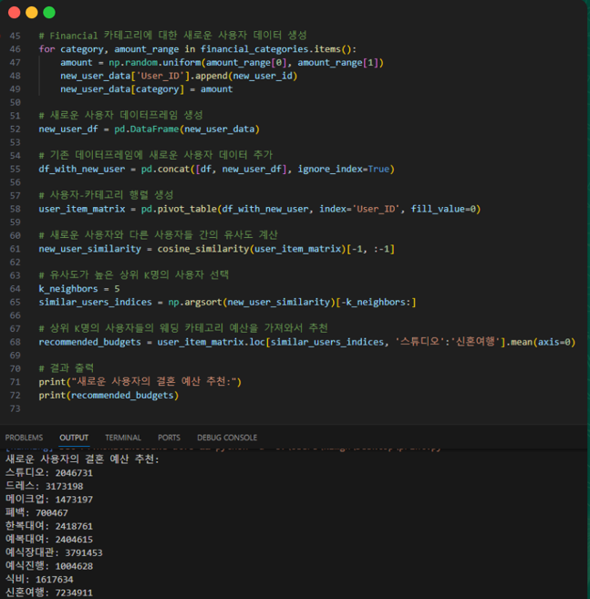
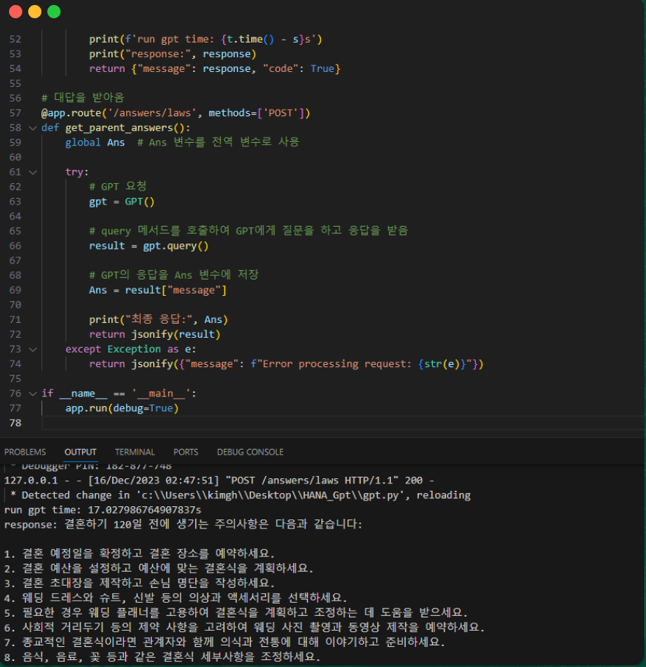
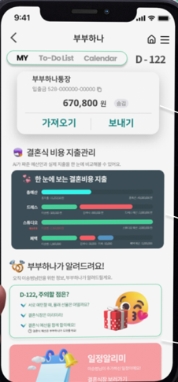
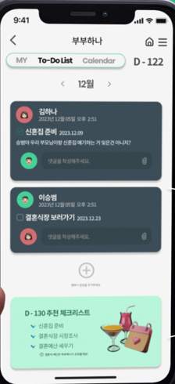
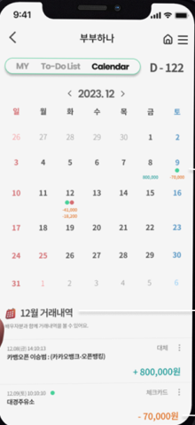
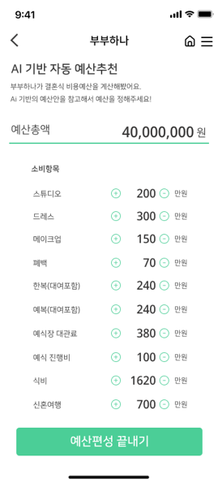
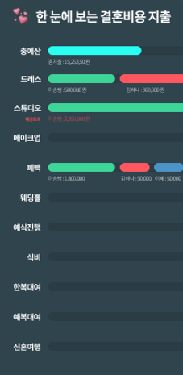
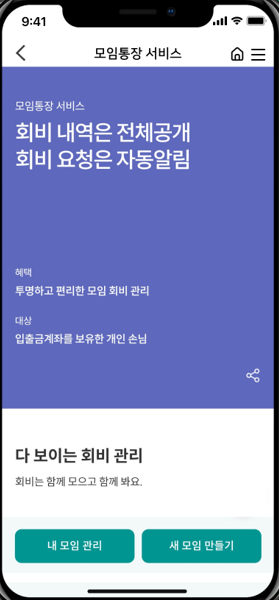

# 하나 디지털 파워 온 프로젝트 2기 - 장려상

 

## 프로젝트 주제
신혼부부를 위한 결혼 도움 서비스 - 부부 HANA

 

## 프로젝트 기간
| 구분 | 기간 | 총 기간 | 비고 |
| -- | -- | -- | -- |
| 전체 기간 | 2023.06.12 ~ 2023.12.20 | 6개월 |  |
| 예/본선 | 2023.06.12 ~ 2023.08.10 | 2개월 | 선형회귀를 이용한 재정/소비 추천 |
| 디지털 인재 양성과정 | 2023.08.14 ~ 2023.09.04 | 1개월 | 메가존클라우드 교육 |
| SKT 하나은행 해커톤 | 2023.09.07 ~ 2023.09.08 | 2일 | LLM API를 활용한 다문화 가정 소통 서비스 |
| 멘토링 | 2023.10.05 | 1일 | 멘토링 및 주제 선정 |
| 결승 | 2023.10.05 ~ 2023.12.20 | 2개월 | 비용 추천 알고리즘과 LLM API를 활용한 신혼부부 도움 서비스 |

 

## 팀원 소개

| 이름   | 직위                  | 역할                       |
|---------|------------------------|-----------------------------|
| 이승범  | 팀장     | 주제 방향성 선정 및 발표  |
| 김건호   | 팀원    | 기술 선정 및 구현               |
| 임경민   | 팀원   | PPT 제작 및 피그마 제작            |

 

## 프로젝트 개요
- 0.70의 저출산 실태 (2023년 2분기)
- 결혼 준비의 어려움
  - 결혼 비용 계산의 어려움
  - 준비 시간의 부족
  - 지출관리의 어려움

 

## 구현 목표
- 추천 기반 자동예산편성
  - 코사인 유사도
- 일정 관리
  - to do 리스트
  - D-DAY별 GPT API 기반 추천 리스트
- 비용 지출 관리

 

## 개발 화면
### 코사인 유사도

### GPT API 추천

## 부부 하나 화면
### MY / To-Do List / Calendar
 |  | 

### 예산 설정 / 비용 지출
 | 

### 모임 통장

 

## 기대효과
- 결혼 결정의 긍정 마인드 생성
- 결혼 준비의 어려움 해소
- 신혼부부 대상의 금융상품 연결 및 홍보 수단

 

## 느낀점
다른 전공의 사람들과 같이 해 본 프로젝트였습니다. 이 프로젝트에서 가장 좋았던 점을 고르라고 하면 바로 다른 시선으로 바라볼 수 있었다는 것입니다. 단순히 기술자들의 시선이 아닌, 기술자가 아닌 시선으로 바라보았을 때, 저 서비스가 지금 현재 어떤 느낌이고 어떤 방향으로 develop 시켜야 될 지를 그들의 시선에서 볼 수 있었습니다.

확실히 기술자들과는 달리 고객의 니즈를 조금 더 파악하고자 하는 경향이 있었고 그 예상은 정확히 들어맞았습니다. 실제로 회사에서도 그들의 말에 조금 더 수긍하고 정책이나 서비스적으로 개선할 수 있는 방향성을 찾는 느낌이었습니다. 기술도 물론 중요하지만 더 중요한 것을 깨닫고 내가 어떤 시각에서 봐야 할 지를 경험할 수 있는 프로젝트였습니다.
